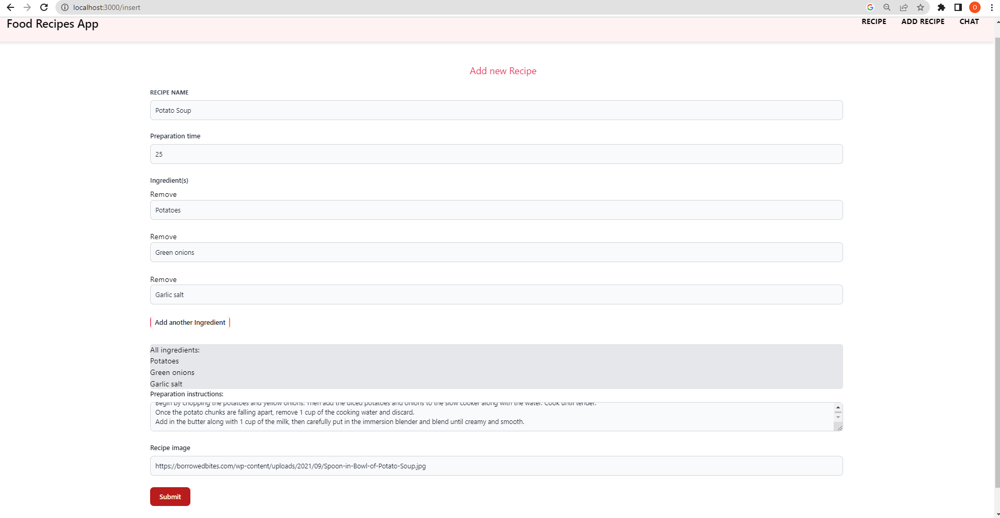

# Food Recipes App

Student: Țucă Oana-Bianca, grupa 1121 SIMPRE
# 1.Intoroducere: 
Acest proiect are la bază o aplicație web dezvoltată cu ajoutorul tehnologiei Next.js .

Serviciile în cloud folosite sunt:
#### 1.MongoDB --> baza de date NoSQL cu ajutorul căreia sunt stocate informațiile rețetelor: denumire, timp de preparare, instrucțiuni, ingrediente și link către imagine. 
### 2.ChatGPT-API --> pentru a descoperi rapid rețete culinare.
### 3.Vercel --> pentru deploymentul aplicației dezvoltate. 

# Link Github
Linkul către codul sursă : https://github.com/OanaBiancaTuca/cc-proiect.git

# Link aplicație publică
Aplicatia a fost deployata si se poate accesa aici: 
https://cc-proiect-sand.vercel.app/

# Link Video
Scurt video de prezentare: https://youtu.be/McYPzfqncRs

# 2.Descriere problemă 
Aplicația de tip SaaS pentru stocarea și descoperirea de rețete culinare este gândită pentru a rezolva probleme ale utilizatorilor, precum:
### Organizarea și accesibilitatea rețetelor: 
#### Aplicația oferă utilizatorilor posibilitatea de a stoca și organiza rețetele culinare într-un mod structurat și ușor de accesat. Utilizatorii pot adăuga, șterge, gestiona rețetele lor personale într-un singur loc centralizat. Astfel, problema pierderii sau rătăcirii rețetelor este eliminată, iar utilizatorii au acces rapid la rețetele lor preferate oriunde și oricând au nevoie de ele.
### Descoperirea de noi rețete:
#### Aplicația oferă funcționalități de căutare a unor noi rețete culinare. Utilizatorii pot cere inspirație pentru a încerca preparate culinare noi și interesante. Astfel, problema monotoniei și lipsei de idei în bucătărie poate fi rezolvată, oferind utilizatorilor o gamă variată de opțiuni culinare. Această problemă este rezolvată prin utilizarea ChatGPT API: Integrarea serviciului ChatGPT API în aplicație permite utilizatorilor să interacționeze cu un consultant virtual pentru a descoperi noi rețete sau pentru a obține sfaturi și sugestii culinare. Aceasta adaugă o componentă de inteligență artificială și interacțiune conversațională la aplicație.
#
# 3.Descriere API
#### OpenAI - ChatGPT API este un serviciu oferit de OpenAI, care le permite dezvoltatorilor să integreze funcționalitățile de conversație ale modelului de limbaj ChatGPT în aplicațiile lor. ChatGPT este un model de inteligență artificială dezvoltat de OpenAI, antrenat pe volume masive de texte pentru a genera răspunsuri coerente și contextuale la întrebări și prompt-uri în limbaj natural.

Prin intermediul ChatGPT API, dezvoltatorii pot trimite cereri HTTP către serverele OpenAI pentru a obține răspunsuri de la modelul ChatGPT în timp real. Acest API facilitează interacțiunea cu modelul și permite dezvoltatorilor să integreze funcționalități de conversație avansate în aplicațiile lor, cum ar fi chatbot-uri, asistenți virtuali sau alte sisteme de interacțiune bazate pe text.
Request de tip POST utilizat pentru chatGPT:
```
let response = await fetch('/api/answer', {
					method: 'POST',
					headers: {
						'Content-Type': 'application/json',
					},
					body: JSON.stringify({
						messages: filteredChatHistory,
						type: 'jamila',
					}),
					signal: AbortSignal.timeout(20000),
				});
				response = await response.json();

```
#### În codul de mai sus, se face o cerere către un API (/api/answer) folosind metoda POST. Se trimit următoarele informații în antetul cererii: 'Content-Type' setat la 'application/json'. Corpul cererii conține un obiect JSON care include un array de mesaje filtrate (filteredChatHistory) și tipul de asistent ('jamila').

De asemenea, se setează un semnal de anulare a cererii cu o limită de timp de 20000 milisecunde (20 de secunde) folosind AbortSignal.timeout(20000).

Este important să menționez că acest cod este doar un fragment și nu include întregul context al aplicației.
#### 
Pentru a beneficia de OpenAI API, este necesară obținerea unei chei de autentificare (API key) care permite realizarea solicitărilor către API-ul lor. Această cheie poate fi obținută prin înregistrarea unui cont pe platforma OpenAI și selectarea unui plan de abonament potrivit.

```
	SIMPLE_ASSISTANT: {
		MESSAGE: {
			'role': 'system',
			'content': 'You are a simple assistant. You respond with simple sentences.',
		},
		TEMPERATURE: 1,
		MAX_TOKENS: 50,
		TYPE: 'simple_assistant',
	},
	JAMILA: {
		MESSAGE: {
			'role': 'system',
			'content': 'You are pretending to be Jamila in her cuisine and you offer short answers and simple recipes. You try to be funny',
		},
		TEMPERATURE: 1,
		MAX_TOKENS: 100,
		TYPE: 'jamila',
	},
```
#### Configurația de mai sus descrie două tipuri de asistenți virtuali: SIMPLE_ASSISTANT și JAMILA.

SIMPLE_ASSISTANT este un asistent virtual simplu, care răspunde cu propoziții simple. Are o limită de 50 de tokeni (unități de limbaj) pentru fiecare răspuns generat și o temperatură de 1, ceea ce înseamnă că va genera răspunsuri mai previzibile și mai puțin creative.

JAMILA este un asistent virtual care se prezintă ca fiind Jamila în bucătăria ei și oferă răspunsuri scurte și rețete simple. Încearcă să fie amuzantă în interacțiunea cu utilizatorii. Are o limită de 100 de tokeni pentru fiecare răspuns și o temperatură de 1.

Aceste configurații permit personalizarea comportamentului asistenților virtuali în funcție de nevoile și stilul dorit pentru fiecare tip de asistent.

# 4.Flux de date

## Exemple de request / response
## În cadrul acestei aplicatii am implementat principalele requesturi : GET, POST, DELETE.
### Metode GET: prin care citesc datele
o	http://localhost:3000/api/records - prin care obțin toate rețetele din baza de date
#### Exemplu de request: http://localhost:3000/api/records 
#### Exemplu de response: 
```
{
    "data": [
        {
            "_id": "644e3998fd4594591d4a3e7e",
            "name": "Banana Pancakes",
            "time": "15",
            "ingredients": "Banana, Egg, Flour and milk",
            "instructions": "Step 1\nMash banana in a medium bowl until smooth. Whisk in egg, then flour until smooth. Set aside for 5 minutes.\nStep 2\nLightly spray a medium non-stick frying pan with oil and heat over medium heat. Spoon 2 tablespoons batter into pan and spread out with the back of a spoon until 1cm thick. Repeat with remaining batter to make 2 more pancakes.\nStep 3\nCook for 1–2 minutes or until golden. Turn and cook for 1–2 minutes or until pancakes are golden and cooked through. Serve.\n",
            "image": "https://img.taste.com.au/0fRoktpV/w720-h480-cfill-q80/taste/2019/07/3-ingredient-banana-pancakes-151444-1.jpg"
        },
        {
            "_id": "645b9b4552358d52265509f5",
            "name": "Pesto pasta",
            "time": "10",
            "ingredients": "500g pack spaghetti,2-3 tbsp pesto from a jar,50g parmesan ",
            "instructions": "Boil spaghetti in a large pan according to pack instructions. Drain well, then return to the pan with the pesto and half the Parmesan. Toss well, then tip into a serving bowl and sprinkle with the remaining Parmesan.",
            "image": "https://images.immediate.co.uk/production/volatile/sites/30/2020/08/recipe-image-legacy-id-327725_12-a882af2.jpg?quality=90&webp=true&resize=375,341"
        },
        {
            "_id": "645b9be852358d52265509f6",
            "name": "Roast tomatoes",
            "time": "10",
            "ingredients": "Tomatoes,Garlic,Balsamic vinegar,olive oli",
            "instructions": "Heat the oven to 160C/140C fan/gas 3. Put the tomatoes on a baking sheet with the garlic and thyme, drizzle over the balsamic vinegar and olive oil. Add some seasoning and roast for 1 hr. Remove and set aside to cool.",
            "image": "https://images.immediate.co.uk/production/volatile/sites/30/2020/08/recipe-image-legacy-id-740488_11-314717c.jpg?quality=90&webp=true&resize=375,341"
        },
        {
            "_id": "645b9e6f7746015b282c7dbd",
            "name": "",
            "time": "15",
            "ingredients": "pound bacon strips, frozen fully cooked breakfast sausage links, thawed,1/2 cup plus 2 tablespoons packed brown sugar, divided",
            "instructions": "Cut bacon strips widthwise in half; cut sausage links in half. Wrap a piece of bacon around each piece of sausage. Place 1/2 cup brown sugar in a shallow bowl; roll sausages in sugar. Secure each with a toothpick. Place in a large bowl. Cover and refrigerate 4 hours or overnight.\nPreheat air fryer to 325°. Sprinkle wrapped sausages with 1 tablespoon brown sugar. In batches, arrange sausages on a single layer in greased tray in air-fryer basket. Cook until bacon is crisp, 15-20 minutes, turning once. Sprinkle with remaining 1 tablespoon brown sugar.",
            "image": "https://www.tasteofhome.com/wp-content/uploads/2022/01/Air-Fryer-Sausage-Bacon-Bites_EXPS_TOHDJ23_267601_DR_07_19_7b.jpg?fit=700,1024"
        }
    ]
}
```
### Metoda POST: prin care creez date 

o	http://localhost:3000/api/records - inserez o noua reteta in baza de date
#### Exemplu de request:
```
   {
            "name": "Grilled Buttermilk Chicken",
            "time": "15",
            "ingredients": "buttermilk, fresh thyme sprigs, garlic cloves, halved, teaspoon salt ",
            "instructions": "Place the buttermilk, thyme, garlic and salt in a large bowl or shallow dish. Add chicken and turn to coat. Refrigerate 8 hours or overnight, turning occasionally.Drain chicken, discarding marinade. Grill, covered, over medium heat until a thermometer reads 165°, 5-7 minutes per side.",
            "image": "https://www.tasteofhome.com/wp-content/uploads/2019/03/Grilled-Buttermilk-Chicken_EXPS_BFBZ19_193422_B01_16_4b-2.jpg?fit=700,1024"
        }
```
#### Exemplu de response de tip 200 OK:
```
{
    "data": {
        "acknowledged": true,
        "insertedId": "645bc76a7746015b282c7dbe"
    }
}
```
### Metoda POST: pentru integrarea  OpenAI - ChatGPT API
o	http://localhost:3000/api/answer
#### Exemplu de request:
```
{
"messages": [
{
"role": "user",
"content": "Hello.. can you give me a recipe for pancakes?"
}
],
"type": "jamila"
}
```
#### Exemplu de response de tip 200 OK:
```
{
    "data": {
        "message": {
            "role": "assistant",
            "content": "Hi there! Of course, I have a pancake recipe that's as easy as 1-2-3. \n\nIngredients:\n-1 cup flour \n-2 tablespoons sugar \n-2 teaspoons baking powder \n-1/4 teaspoon salt \n-1 cup milk \n-1 egg \n-2 tablespoons melted butter \n\nDirections: \n1. In a large bowl, sift together flour, sugar, baking powder and salt. \n2. In a separate bowl, beat the egg and add milk"
        },
        "finish_reason": "length",
        "index": 0
    }
}
```
### Metoda DELETE :prin care șterg date
o	http://localhost:3000/api/records/?id=645bd0cf7746015b282c7dc0 - pe baza id-ului indicat, șterg reteta din baza de date
### Exemplu de request: http://localhost:3000/api/records/?id=645bd0cf7746015b282c7dc0

#### Exemplu de response de tip 200 OK:
```
{
    "data": {
        "acknowledged": true,
        "deletedCount": 1
    }
}
```

## Autentificare și autorizare servicii utilizate
#### Autentificarea și autorizarea sunt aspecte importante în utilizarea serviciilor MongoDB și OpenAI ChatGPT.

Pentru a utiliza serviciile MongoDB, am creat un utilizator cu un nume de utilizator și o parolă pentru a asigura autentificarea în baza de date.În plus, am configurat drepturi de acces care permit adrese IP să se conecteze la baza de date. 
Pentru a accesa serviciul ChatGPT, am creat un cont și am generat o cheie API (API key). Această cheie API este utilizată pentru autentificare și autorizare în serviciul ChatGPT.
Prin adoptarea acestor măsuri de securitate:
-  fișierul .env al proiectului, care păstrează informațiile cheilor, nu este încărcat pe GitHub 
- configurarea variabilelor de mediu în platforma Vercel, în zona de Environment Variables, pentru a asigura o gestionare sigură a cheilor.
### se asigură că accesul la serviciile utilizate este controlat și restricționat numai utilizatorilor autorizați, iar cheile și informațiile sensibile sunt protejate împotriva accesului neautorizat.

# 5. Capturi ecran aplicație
## Ecran principal - Gestionare lista rețete 
- Vizualizare rețete culinare
- Eliminare din listă rețetă selectată
##


## Ecran adăugare rețetă
- Utilizatorii pot adauga/sterge ingrediente cu ajutorul butoanelor
,,Add another Ingredient"/ ,,Remove"
- Adăugarea se face prin apăsarea butonului ,,Submit"
##
 
 ##
- Dupa salvare, reteta va fi afisata in pagina principala:
##
 
 ##
## Ecran chat
- Utilizatorii pot cere inspirație pentru a încerca preparate culinare noi și interesante
 

 # Concluzii 
 #### În ansamblu, o aplicație pentru rețete culinare oferă un mediu organizat și intuitiv pentru a gestiona și explora rețetele culinare, facilitând procesul de gătit și aducând o experiență culinară îmbunătățită și diversificată pentru utilizatori.
# 6. Referințe
- https://www.awesomescreenshot.com/blog/knowledge/chat-gpt-api
- https://www.mongodb.com/what-is-mongodb
- https://www.techtarget.com/searchcloudcomputing/definition/Software-as-a-Service
- https://v2.tailwindcss.com/docs
- https://gurita-alexandru.gitbook.io/cloud-computing-2023-simpre/
- https://github.com/guritaalexandru/cc-next-2
- https://www.mongodb.com/docs/drivers/node/current/fundamentals/crud/
- https://platform.openai.com/docs/introduction​
- https://nextjs.org/docs
